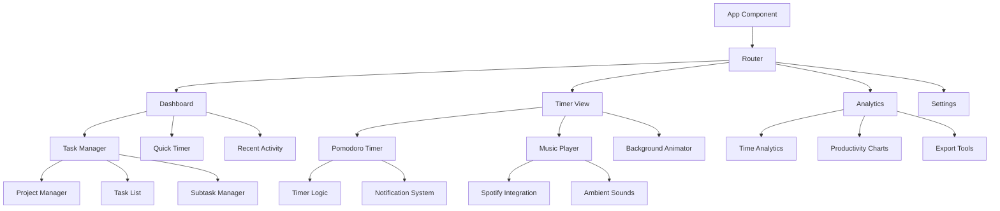

# Pomodoro Timer App - Architecture Plan

## Project Overview
A modern, cozy Pomodoro timer web application built with React, featuring glassmorphic design, animated backgrounds, external music integration, and comprehensive task management capabilities.

## Technology Stack

### Frontend
- **React 18** with TypeScript for type safety
- **Vite** for fast development and building
- **CSS Modules** + **Styled Components** for glassmorphic styling
- **Framer Motion** for smooth animations
- **React Query** for state management and API calls
- **React Router** for navigation

### External Integrations
- **Spotify Web API** for music streaming
- **YouTube API** (fallback option)
- **Web Audio API** for ambient sounds

### Data & Storage
- **IndexedDB** via Dexie.js for local data persistence
- **Firebase** (optional) for cloud sync and backup
- **LocalStorage** for user preferences

### PWA & Performance
- **Workbox** for service worker and caching
- **Web Push API** for notifications
- **Web Workers** for background tasks

## Application Architecture



## Core Features

### 1. Pomodoro Timer System
- **Customizable Intervals**: Work (25min), Short Break (5min), Long Break (15min)
- **Timer States**: Focus, Short Break, Long Break, Paused
- **Session Tracking**: Automatic session counting and cycle management
- **Smart Notifications**: Browser notifications with custom sounds

### 2. Glassmorphic UI Design
- **Glass Cards**: Translucent containers with backdrop blur
- **Gradient Overlays**: Dynamic color gradients based on timer state
- **Smooth Transitions**: Framer Motion animations for state changes
- **Responsive Layout**: Mobile-first design with desktop enhancements

### 3. Animated Backgrounds
- **Theme System**: Multiple ambient themes (Forest, Ocean, Space, City)
- **Particle Systems**: Floating particles and geometric shapes
- **Color Transitions**: Smooth color changes based on timer state
- **Performance Optimized**: Canvas-based animations with requestAnimationFrame

### 4. Music & Audio Integration
- **Spotify Integration**: 
  - OAuth authentication
  - Playlist browsing and selection
  - Playback control
  - Focus music recommendations
- **Ambient Sounds**: Built-in nature sounds and white noise
- **Audio Mixing**: Volume controls for music and ambient sounds
- **Smart Pause**: Auto-pause during breaks if desired

### 5. Comprehensive Task Management
- **Projects**: Hierarchical project organization
- **Tasks & Subtasks**: Nested task structure with dependencies
- **Time Tracking**: Automatic time logging per task
- **Priority System**: High, Medium, Low priority levels
- **Due Dates**: Calendar integration and deadline tracking
- **Tags & Categories**: Flexible organization system

### 6. Analytics & Insights
- **Daily/Weekly/Monthly Views**: Productivity trends over time
- **Focus Time Analysis**: Deep work vs. break time ratios
- **Task Completion Rates**: Success metrics and patterns
- **Productivity Heatmaps**: Visual representation of productive hours
- **Export Capabilities**: CSV, JSON data export

## Component Structure

### Core Components
```
src/
├── components/
│   ├── Timer/
│   │   ├── PomodoroTimer.tsx
│   │   ├── TimerDisplay.tsx
│   │   ├── TimerControls.tsx
│   │   └── SessionIndicator.tsx
│   ├── Tasks/
│   │   ├── TaskManager.tsx
│   │   ├── ProjectList.tsx
│   │   ├── TaskList.tsx
│   │   ├── TaskItem.tsx
│   │   └── SubtaskManager.tsx
│   ├── Music/
│   │   ├── MusicPlayer.tsx
│   │   ├── SpotifyIntegration.tsx
│   │   ├── AmbientSounds.tsx
│   │   └── AudioControls.tsx
│   ├── UI/
│   │   ├── GlassCard.tsx
│   │   ├── Button.tsx
│   │   ├── Modal.tsx
│   │   └── LoadingSpinner.tsx
│   └── Background/
│       ├── AnimatedBackground.tsx
│       ├── ParticleSystem.tsx
│       └── ThemeSelector.tsx
```

## Data Models

### Timer State
```typescript
interface TimerState {
  mode: 'focus' | 'shortBreak' | 'longBreak';
  timeRemaining: number;
  isRunning: boolean;
  currentSession: number;
  totalSessions: number;
  currentTask?: Task;
}
```

### Task Management
```typescript
interface Project {
  id: string;
  name: string;
  description?: string;
  color: string;
  createdAt: Date;
  tasks: Task[];
}

interface Task {
  id: string;
  projectId: string;
  title: string;
  description?: string;
  priority: 'high' | 'medium' | 'low';
  status: 'todo' | 'inProgress' | 'completed';
  estimatedPomodoros: number;
  completedPomodoros: number;
  dueDate?: Date;
  tags: string[];
  subtasks: Subtask[];
  timeSpent: number;
  createdAt: Date;
  completedAt?: Date;
}

interface Subtask {
  id: string;
  title: string;
  completed: boolean;
  createdAt: Date;
}
```

### Analytics Data
```typescript
interface SessionRecord {
  id: string;
  taskId?: string;
  projectId?: string;
  startTime: Date;
  endTime: Date;
  duration: number;
  type: 'focus' | 'shortBreak' | 'longBreak';
  completed: boolean;
}

interface DailyStats {
  date: Date;
  totalFocusTime: number;
  totalBreakTime: number;
  sessionsCompleted: number;
  tasksCompleted: number;
  productivity: number; // 0-100 score
}
```

## API Integration

### Spotify Web API
- **Authentication**: OAuth 2.0 with PKCE flow
- **Endpoints**: 
  - User playlists
  - Search tracks/playlists
  - Playback control
  - Currently playing
- **Scopes**: `streaming`, `user-read-playback-state`, `user-modify-playback-state`

### Local Storage Schema
```typescript
interface AppStorage {
  user: UserPreferences;
  projects: Project[];
  tasks: Task[];
  sessions: SessionRecord[];
  analytics: DailyStats[];
  settings: AppSettings;
}
```

## Performance Considerations

### Optimization Strategies
1. **Code Splitting**: Route-based and component-based lazy loading
2. **Memoization**: React.memo for expensive components
3. **Virtual Scrolling**: For large task lists
4. **Service Worker**: Offline functionality and caching
5. **Image Optimization**: WebP format with fallbacks
6. **Bundle Analysis**: Regular bundle size monitoring

### Accessibility Features
- **Keyboard Navigation**: Full keyboard support
- **Screen Reader**: ARIA labels and semantic HTML
- **High Contrast**: Theme options for visual accessibility
- **Focus Management**: Proper focus handling during timer states
- **Reduced Motion**: Respect user's motion preferences

## Security & Privacy
- **Data Encryption**: Sensitive data encryption in storage
- **API Key Management**: Secure handling of external API keys
- **User Consent**: Clear privacy policy and data usage
- **Local-First**: Primary data storage remains local

## Deployment Strategy
- **Static Hosting**: Vercel, Netlify, or GitHub Pages
- **PWA Manifest**: App-like experience on mobile
- **Environment Variables**: Secure API key management
- **CI/CD Pipeline**: Automated testing and deployment

This architecture provides a solid foundation for building a comprehensive, modern Pomodoro timer application that meets all your requirements while maintaining excellent performance and user experience.